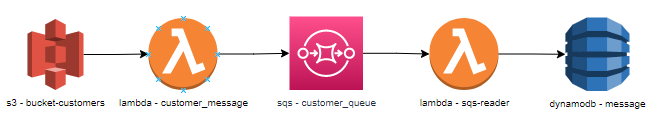

# S3 to DynamoDB
This repo includes app and infra code to setup an environment where lambda functions are triggered to store the data in DynamoDB when certain csv files are uploaded in S3 bucket.

When a file is uploaded into S3 bucket, the lambda function is triggered. The lambda function checks if there are customers, orders and items files are present for the date. If so, it processes the data and sends the prepared json data to SQS. Whenever SQS has data, another lambda function is triggered to store the data in DynamoDB table.

S3EventHandler.java is used in the first lambda function (bucket_customers).
SQSHandler.java is used in the second lambda function (sqs-reader).

IaC code is stored under terraform folder.